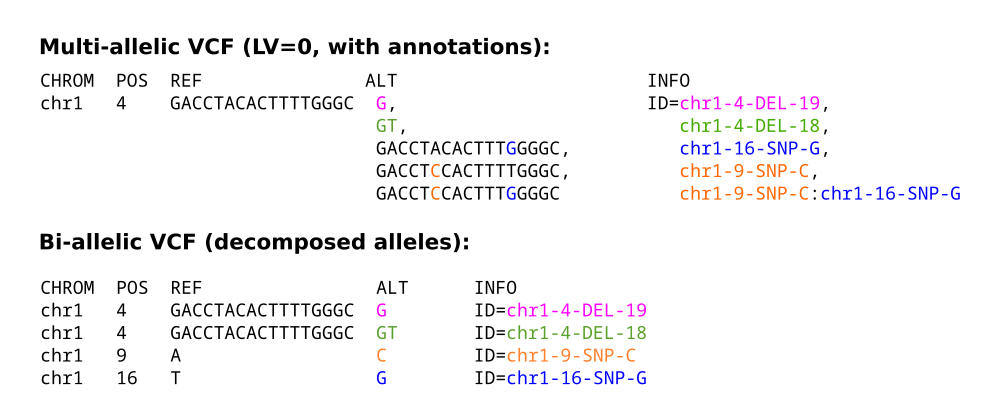

# PanGenie cohort genotyping

Pipeline to genotype a cohort with PanGenie, phase the genotypes and construct polished consensus haplotypes. Standalone pipeline of the genotyping pipeline used for the HPRC2 companion paper, commit: d0bfa31 (https://github.com/eblerjana/hprc2-companion/tree/main/genotyping-pipeline/)

## What the pipeline can do

This pipeline can be used to run PanGenie on a large cohort of samples (e.g. the 1000 Genomes cohort), including filtering of the genotypes. Genotypes can be phased with population-based phasing tool SHAPEIT and (polished) consensus haplotypes can be generated based on phased genotypes and a polishing pipeline using long read data (if available).

## How to set up

In order to run the pipeline, paths to required input data must be provided in the config file as explained below. Required is a PanGenie-ready input VCF (annotated multi-allelic and bi-allelic versions) as provided below in section "Existing datasets", or as produced by this pipeline: https://bitbucket.org/jana_ebler/vcf-merging/src/master/. Alternatively, a Minigraph-Cactus graph GFA and VCF file (with top-level bubbles, not vcfwave decomposed) can be provided. See Section "Required input data" and the examples below for details on the required input data. The following sections in the config file need to be filled:


```yaml

# Optional: PanGenie ready VCFs
panel_bi: "/path/to/callset.vcf.gz"
panel_multi: "/path/to/graph.vcf.gz"

# Optional: Minigraph Cactus GFA/VCF
mc_vcf: "/path/to/graph.vcf.gz"
mc_gfa: "/path/to/graph.gfa.gz"
samples_to_exclude:
        - GRCh38

# reference genome
reference: "/path/to/reference.fa"
# reference used for long read CRAM files
cram_ref: "/path/to/cram-ref.fa"
# sample sheet: TSV file with information on sample and read data. Required columns (in this order):
#FamilyID	SampleID	FatherID	MotherID	Sex	Population	Superpopulation	SampleIllumina	SampleLong	Readtech
#
#FamilyID: specifies the name of a trio
#SampleID: name of the child sample
#FatherID: name of the father (0 if not available)
#MotherID: name of the mother (0 if not available)
#Sex: sex of the SampleID sample
#Population: which population the sample is from (UNKNOWN if not known)
#Superpopulation: which superpopulation (AFR, AMR, EAS, EUR, SAS)
#SampleIllumina: path to FASTA/FASTQ file with Illumina reads of child sample
#SampleLong: path to CRAM file with HiFi or ONT reads of sample, nan if not available
#Readtech: whether previous column contains HiFi or ONT reads, must be either HIFI or ONT, or nan if previous column was nan.

sample-sheet: "sample-sheet.tsv" 
# name of the output folder
outname: "results"


# genetic maps to be used for phasing with SHAPEIT.
maps:
 chr1: "/path/to/chr1.gmap.gz"
 chr2: "/path/to/chr2.gmap.gz"
 [...]

```

See the current config file `` config/config.yaml `` for an example.

## Required input data

### VCFs (``panel_bi`` and  ``panel_multi``)
This pipeline requires two input VCFs: a multi-allelic VCF representing bubbles and haplotypes in a pangenome graph ("multi"), and a bi-allelic callset VCF describing the underlying variant alleles ("bi"). In the mult-allelic VCF, each record represents a bubble in the graph and lists all paths covered by at least one haplotypes as the alternative allele sequences. Each such alternative allele is annotated by a sequence of variant IDs (separated by a colon) in the INFO field, indicating which individual variant alleles it is composed of (since bubbles are usually composed of many individual variant alleles). The bi-allelic VCF contains one separate record for each such variant ID. See the figure below for an illustration. Both VCFs describe the same genetic variation, but using different ways of representation. In this pipeline, the multi-allelic VCFs are used as input to PanGenie for genotyping. Using the annotations, the resulting bubble genotypes can be translated into genotypes for each individual variant ID. This enables properly analysing variant alleles contained inside of bubbles.




### Minigraph-Cactus graph (``mc_vcf`` and ``mc_gfa``)

The pipeline requires either VCFs (``panel_bi`` and  ``panel_multi``) or alternatively, a Minigraph-Cactus graph as input. In case you want to run it from a MC graph, you need to provide the corresponding GFA file to ``mc_gfa`` and the VCF with top-level bubbles produced by the MC pipeline as ``mc_vcf``. The VCF must be preprocessed with ``vcfbub`` and must not be decomposed with vcfwave. The MC pipeline outputs such a VCF, so no further processing is needed.


### reference 
FASTA file containing the reference genome underlying the VCF. If long read data is additionally provided (for polishing), then a separate reference needs to be specified which CRAMs are aligned to.

### sample sheet
A TSV file of the format shown below that provides paths to FASTA/FASTQ files with **short-read** sequencing data, as well as **long read** CRAMs if polishing shall be run.

```bat

<FamilyID> <SampleID> <FatherID> <MotherID> <Sex> <Population> <Superpopulation> <SampleIllumina> <SampleLong> <ReadTech>

```

**FamilyID**: specifies the name of a trio
**SampleID**: name of the child sample
**FatherID**: name of the father (0 if not available)
**MotherID**: name of the mother (0 if not available)
**Sex**: sex of the SampleID sample
**Population**: which population the sample is from (UNKNOWN if not known)
**Superpopulation**: which superpopulation (AFR, AMR, EAS, EUR, SAS)
**SampleIllumina**: path to FASTA/FASTQ file with Illumina reads of child sample
**SampleLong**: path to CRAM file with HiFi or ONT reads of sample, nan if not available
**Readtech**: whether previous column contains HiFi or ONT reads, must be either HIFI or ONT, or nan if previous column was nan.


See  `` 1kg-hprc2-sample-sheet-withONT.tsv `` for an example.


### Genetic maps

If phasing shall be run, genetic map files need to be provided, required by SHAPEIT. Provide one file for each chromosome to be phased.


## Existing datasets

We have already produced input reference panels for several datasets from high-quality, haplotype-resolved assemblies that can be used as input to this pipeline. Existing datasets can be found here:

| Dataset | multi-allelic graph VCF        |  bi-allelic callset VCF         | 
|-------------| :-------------: |:-------------:| 
| HGSVC-GRCh38 (freeze3, 64 haplotypes) | [graph-VCF](https://zenodo.org/record/7763717/files/pav-panel-freeze3.vcf.gz?download=1) | [callset-VCF](https://zenodo.org/record/7763717/files/pav-calls-freeze3.vcf.gz?download=1) | 
| HGSVC-GRCh38 (freeze4, 64 haplotypes) |  [graph-VCF](https://zenodo.org/record/7763717/files/pav-panel-freeze4.vcf.gz?download=1)     | [callset-VCF](https://zenodo.org/record/7763717/files/pav-calls-freeze4.vcf.gz?download=1) | 
| HPRC-GRCh38 (88 haplotypes) | [graph-VCF](https://zenodo.org/record/6797328/files/cactus_filtered_ids.vcf.gz?download=1)     |  [callset-VCF](https://zenodo.org/record/6797328/files/cactus_filtered_ids_biallelic.vcf.gz?download=1)    | 
| HPRC-CHM13 (88 haplotypes) | [graph-VCF](https://zenodo.org/record/7839719/files/chm13_cactus_filtered_ids.vcf.gz?download=1) | [callset-VCF](https://zenodo.org/record/7839719/files/chm13_cactus_filtered_ids_biallelic.vcf.gz?download=1)   | 
| HGSVC3 + HPRC (CHM13, 214 haplotypes) | [graph-VCF](https://ftp.1000genomes.ebi.ac.uk/vol1/ftp/data_collections/HGSVC3/release/Genotyping_1kGP/PanGenie-genotypes/1.0/MC_hgsvc3-hprc_chm13_filtered_bubbles.vcf.gz) | [callset-VCF](https://ftp.1000genomes.ebi.ac.uk/vol1/ftp/data_collections/HGSVC3/release/Genotyping_1kGP/PanGenie-genotypes/1.0/MC_hgsvc3-hprc_chm13_filtered_decomposed.vcf.gz)   |
| HPRC2-CHM13 (462 haplotypes) | [graph-VCF](https://s3-us-west-2.amazonaws.com/human-pangenomics/pangenomes/scratch/2026_03_30_pangenie/mc_filtered_ids.vcf.gz) | [callset-VCF](https://s3-us-west-2.amazonaws.com/human-pangenomics/pangenomes/scratch/2026_03_30_pangenie/mc_filtered_ids_biallelic.vcf.gz)   |


## How to run the pipeline

For polishing, we use DeepVariant for small variant calling. For running DeepVariant with singularity in this pipeline, create a singularity image called ``deepvariant.sif`` and put it into a folder called ``workflow/container``.

Paths to input files needed must be specified in the config file: `` config/config.yaml `` as explained in the previous section.
The whole pipeline can then be run using the following command:

``  snakemake --use-singularity --use-conda -j <number of cores>  `` 

Alternatively, different parts of the pipeline can be run individually:

* ``  snakemake genotyping --use-singularity --use-conda -j <number of cores>  ``  Genotypes all cohort samples with PanGenie.
* ``  snakemake phasing --use-singularity --use-conda -j <number of cores>  `` Additionally phases the PanGenie genotypes.
* ``  snakemake polishing --use-singularity --use-conda -j <number of cores>  `` Additionally runs the polishing pipeline on samples for which long read data is provided.

